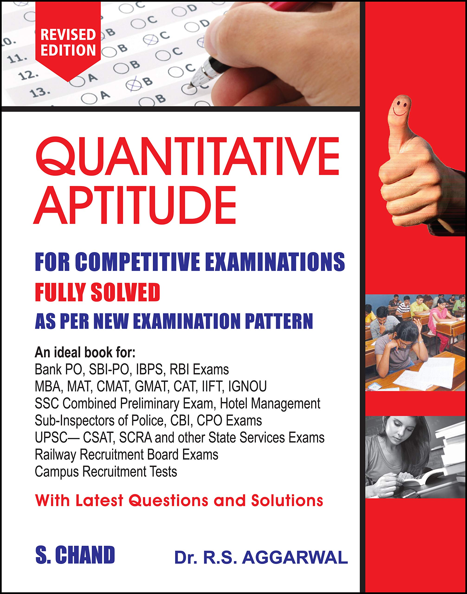
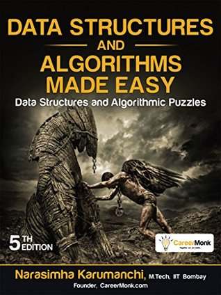
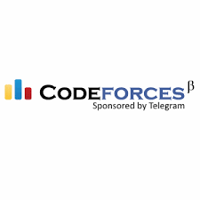

# How-I-cracked-the-first-tech-interview-of-my-life.
[Linkedin](https://www.linkedin.com/in/sakshamsachdeva/)

Here I am sharing my personal experience which I gathered from various online communities and smart fellows. It helped me in cracking the first technical round of my life of a `Fortune 500 MNC` followed by a job offer. I am going to share the roadmap that I followed. Also, all of this is relevant only for MNCs and startups other than The Big Five i.e. Amazon, Apple, Facebook, Microsoft and Google’s parent company Alphabet.

I started my preparation 6 months before the beginning of the placement session of my college. I advise you to start as early as possible because at the end the job is what that matters.

- There are four major rounds in any placement drive :
   - Aptitude Round
   
   - Coding Round
   
   - Face-to-Face Technical Round
   
   - HR Round
   
   Chronology may differ from company to company, some take HR round before technical.
   
   Also, some MNCs take the Chief Technical Officer round (CTO) after all of the above rounds.
   
   
   # Cracking the coding interview
   <a target="_blank" href="https://www.amazon.in/Cracking-Coding-Interview-Programing-Questions/dp/0984782850/ref=sr_1_3?crid=1G4I0RRTMS50R&amp;keywords=cracking+the+coding+interview+latest+edition&amp;qid=1577625401&amp;sprefix=cracking+the+codin%2Caps%2C392&amp;sr=8-3&_encoding=UTF8&tag=sakshamsachde-21&linkCode=ur2&linkId=039a846a4693571c5c026f2ff9c0417c&camp=3638&creative=24630">Cracking the Coding Interview: 189 Programing Questions and Solutions</a>
   
  

  
     It's a gem, written by Gayle Laakmann Mcdowell. Right before starting your interview preparation, you should go through the introduction of this book, that covers,
     - The Interview Process 
     - Behind the Scenes 
     - Special Situations 
     - Before the Interview
     - Behavioral Questions
     - Big O
     - Technical Questions
     - The Offer and Beyond 
     
   Now, 
   
   # Aptitude Round
   Many students  get stuck in this round. Even if you have excellent coding skills but firstly you have to go through this screening round. Many coding geeks face problems when a screening round acts as an obstacle that stops them from showing their skills. I am sharing a list of topics that should be covered for this round.
   
  - Problems on Trains
  
  - Height and Distance
  
  - Simple Interest

  - Profit and Loss

  - Percentage

  - Calendar

  - Average

  - Volume and Surface Area

  - Numbers

  - Problems on H.C.F and L.C.M

  - Simplification

  - Surds and Indices

  - Boats and Streams

  - Logarithm

  - Odd Man Out and Series

  - Time and Distance

  - Time and Work

  - Compound Interest

  - Partnership

  - Problems on Ages

  - Clock

  - Area

  - Permutation and Combination
 
  - Problems on Numbers

  - Decimal Fraction
 
  - Square Root and Cube Root
 
  - Ratio and Proportion

  - Pipes and Cistern

  - Alligation or Mixture

  - Probability

Obviously we are in Btech/MCA we can easily solve these problems. But, WAIT, this ain't enough, because we need to solve these problems within the stipulated time as well. You have to improve your speed, and, for that, learn tricks/shortcuts to solve a particular type of problem. I am sharing a youtube channel for tricks : [SSC ADDA](https://www.youtube.com/channel/UCAyYBPzFioHUxvVZEn4rMJA
)     , but there are many others that can be followed.

Now, you know shortcuts, your speed is improved, it's time to practice.
  Practice questions from : [IndiaBix](https://www.indiabix.com/aptitude/questions-and-answers/)
  
   

    
Further, if you want to practice more, you can also follow RS Agarwal.
  
   # Coding Round  
   
   - The magic of C & C++ :
     - Firstly, you should know the languages C & C++. Although there are many advanced programming languages in the market, but, C and C++ are the basics. Many interviewers expect this and can ask concepts in face-to-face interview rounds or output based questions even in the aptitude round.

      - Practice output based questions on C from : [GeeksforGeeks : C Multiple Choice Questions](https://www.geeksforgeeks.org/c-multiple-choice-questions/)
      - and C++ from : [GeeksforGeeks : C++ Multiple Choice Questions](https://www.geeksforgeeks.org/c-programming-multiple-choice-questions/)

   - The Data Structures & Algorithms :
       - DSA is the root of the coding round. You should have good grip over this. Concepts can be cleared from the book 
           "Data Structures and Algorithms" by Narasimha Karumanchi
           
           <a target="_blank" href="https://www.amazon.in/Data-Structures-Algorithms-Made-Easy/dp/819324527X?&_encoding=UTF8&tag=sakshamsachde-21&linkCode=ur2&linkId=ea34c421fabbb57e2422b95f840f5cf1&camp=3638&creative=24630">Data-Structures-Algorithms-Made-Easy in C++</a>
           
           <a target="_blank" href="https://www.amazon.in/Data-Structures-Algorithms-Made-Easy/dp/8192107558/ref=sr_1_3?crid=1VV1F7T7IR36M&amp;keywords=narashima+karumanchi&amp;qid=1577625567&amp;sprefix=narash%2Caps%2C390&amp;sr=8-3&_encoding=UTF8&tag=sakshamsachde-21&linkCode=ur2&linkId=d5ad91883cdc18565e587c1913ca2e0b&camp=3638&creative=24630">Data-Structures-Algorithms-Made-Easy in Java</a>
           
            

       - You'll definitely need to know:

            - Arrays, strings, linked lists, stacks, queues, trees, graphs, hash maps, hashtables, heaps, priority queues, and linked lists (single/doubly/circular) and other common classes of data structures.
            - Breadth first search, depth first search, binary search, tree traversal (pre/in/post), sorting algorithms (merge/quick/and some O(n^2) ones) and other common classes of algorithms.
            - Time and Space Complexities on all of the above.
            - Recursion/iteration and dynamic programming.
            
       - Practice MCQ's on DSA from [GeeksforGeeks : DSA](https://www.geeksforgeeks.org/data-structure-gq/)   
  Now, when you know DSA It's time to code as much as possible. Spare 1-2 hours daily for this, no matter what.
  
   <table>
  <tr>
     <td></td>
    <td></td>
    <td></td>
    <td></td>
    <td></td>
    <td></td>
    <td></td>
  </tr>
  
</table>

  - Online Coding Platforms :
    - There are many websites for practicing coding questions like HackerRank, Codechef, LeetCode, GeeksforGeeks, HackerEarth, CodeForces etc. But, you don't need to follow all of these sites, Only one will be more than enough. Now, the question arises which site to choose? These coding platforms are divided into two parts : 
       - Competitive Programming - HackerRank, Codechef, HackerEarth, CodeForces 
       - Interview Specific Programming - GeeksforGeeks, LeetCode, InterviewBit.
       
     - Competitive programming is like a sport for coding geeks. You may opt for this if you have a lot of time. But, if your placement    session is just 5-6 months ahead, the Interview specific programming  should be done, as it contains the exact or similar questions that can be asked in your coding round. 
      - You can choose any programming language of your choice for this round.
      - Practice 40-50 questions on each data structure like array, string, linked list, stack, queue, binary tree, hashmap, hashset etc.
          

  # Face-to-Face Technical Round
   - This round is really unpredictable and depends on company to company and moreover on a particular interview panel.
   - The majority of questions are asked from the language of your choice, DBMS, SQL Queries and the projects that you have done.
   - Computer Organization & Networking questions can also be asked but are rare. You cannot skip the same in your preparation.
   
      I can provide resources for Java. You may opt any language for this round.
   
      - You should know the OOPs principles.
      - Study concepts of Java from : [JavaTpoint](https://www.javatpoint.com/java-tutorial)
      - 300 Java Interview Questions : [JavaTpoint : 300 questions](https://www.javatpoint.com/corejava-interview-questions)
      - MCQ's on Java : [GeeksforGeeks](https://www.geeksforgeeks.org/java-multiple-choice-questions/) 
      - Concepts of DBMS from : [StudyTonight : DBMS](https://www.studytonight.com/dbms/)
      - Practice SQL Queries from : [GeeksforGeeks : SQL Queries](https://www.geeksforgeeks.org/sql-tutorial/)
      - Read interview questions on Computer Organization and Networking also.
     
   - Also, you should know each and everything about the projects that you are mentioning in your resume ( or at least the module you have implemented in case of a group project).
      
   # HR Round
  Never ever take this round lightly. HR has the power to screen one out even if he/she has excellent technical skills. There are many standard questions which are asked in almost every HR Round, like :
  
   - Tell me about yourself?
   - What are your strengths and weakness?
   - Why do you want to work for this company?
   - Do you consider yourself successful?
   - What motivates you?
   - Why should we hire you?
   - Where do you see yourself in the next 5 years?
   - How would you know you were successful on this job?
   - What will you do if you don’t get this position?
   - How long would you expect to work for us in case you are hired?
   - Describe your ability to work under pressure.
   - What has disappointed you about work?
   - Are you willing to make sacrifices for this company?
   - How do you propose to compensate for your lack of experience?
   - Would you rather work for money or job satisfaction?
   - Do you have any questions for me?
   
   
   Prepare in advance for questions like these. There are many youtube videos that guide about dealing with a particular question. Basically, we have to talk in terms of organization profits. You have to show how you can be an asset to them. You have to say what they are expecting to listen from a candidate e.g. Consider a question "Where do you see yourself in 5 years?", Now, come on most of the people wants to switch for 30% hike within 1-2 year, But, wait, Then why are they putting efforts on your recruitment if you will leave them within 1-2 years? Got the point?  So, you don't have to tell them your plan instead you can reply with something like “I see myself more ambitious and dedicated fellow after 5 years. In five years, I see myself as a successful (your creative field), subject matter expert and learning new skills that will benefit the company and help me achieve my career goals. I am eager to experience new challenges and excited to invest five years time specializing in a career I find extremely interesting and motivating" ( Just an example).
   
   - Also, prepare for puzzles and riddles.

   
   # Pro-Tips
   - Study about the organization, where you are going to have your interview, like
   
        - What do they do ? 
        - What are there different products?
        - What is going to be my role, if selected?
        - Do I have the necessary skill set for the role? 
        - Do I have my resume tailored for this interview? 
        - How it is like to work there?
        - Rating and reviews on [GlassDoor](https://www.glassdoor.co.in/index.htm)
        - Read past interview experiences from [GeeksforGeeks : Interview Experiences](https://www.geeksforgeeks.org/company-interview-corner/) and [GlassDoor](https://www.glassdoor.co.in/index.htm).
        
   - Mention only those technologies and projects that you know very well. Also, if you have basic knowledge of a particular language or technology then you can mention the same with the level of proficiency.
   - As a fresher, your resume should be only one page long.
   
# Hope this helps :)
   - Follow on [Linkedin](https://www.linkedin.com/in/sakshamsachdeva/)
   - Follow on [Github](https://github.com/sakshamsachdeva)
   - Follow on [Quora](https://www.quora.com/profile/Saksham-Sachdeva-2)
   - E-mail any query to saksham9654@gmail.com
